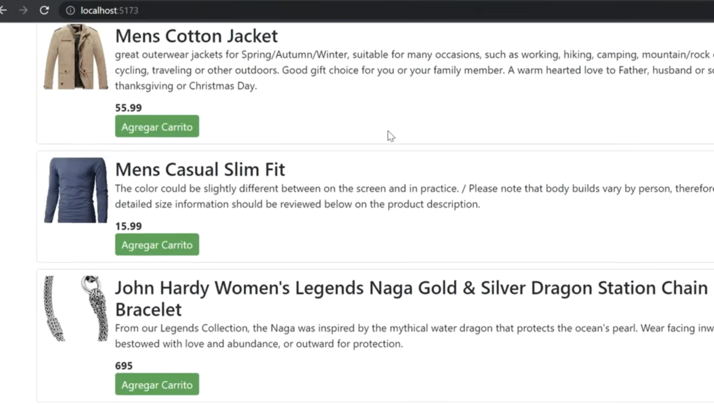
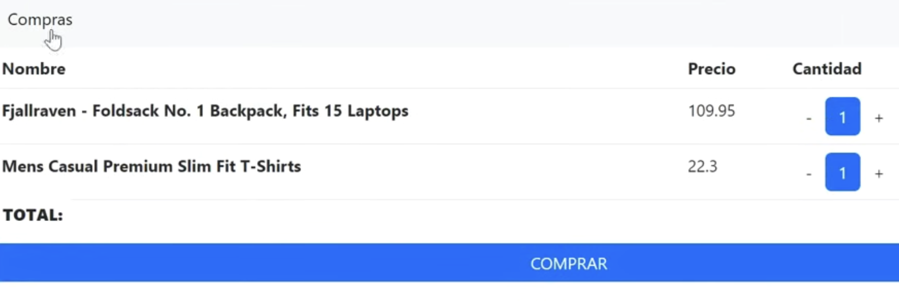

# 🛒 Shopping Cart

Functional e-commerce shopping cart built with **React 19**, featuring product browsing, cart management with quantity controls, and a dynamic checkout experience — all powered by the [Fake Store API](https://fakestoreapi.com/).

### 🔗 [Live Demo](https://shooping-cart-two.vercel.app/)

---

### Tech Stack


---

### Features

- 🛍️ **Product Catalog** — Dynamically fetched from the Fake Store API
- 🛒 **Cart Management** — Add, remove, increase & decrease item quantities
- 💰 **Real-time Total** — Automatically calculates cart total
- 🔄 **State Management** — Built with `useReducer` + React Context API (no external libraries)
- 🧭 **Client-side Routing** — Multi-page navigation with React Router v7
- 🎨 **Material UI Components** — Shopping cart badge with live item count
- 📱 **Responsive Design** — Bootstrap grid + custom CSS
- 🖨️ **Print Receipt** — One-click browser print for checkout summary

---

### Project Structure

```
shooping-cart/
├── index.html
├── package.json
├── vite.config.js
└── src/
    ├── main.jsx                  # App entry point with BrowserRouter
    ├── ShoopingCart.jsx           # Root component with route definitions
    ├── components/
    │   ├── Card.jsx               # Product card with add/remove toggle
    │   └── NavBar.jsx             # Navigation bar with cart badge
    ├── context/
    │   ├── CarritoContext.jsx      # Cart context definition
    │   ├── CarritoProvider.jsx     # Cart state logic (useReducer)
    │   ├── ProductosContext.jsx    # Products context definition
    │   └── ProductosProvider.jsx   # Products fetching & state
    ├── pages/
    │   ├── BuyPage.jsx            # Product listing page
    │   └── Cart.jsx               # Cart/checkout page
    └── styles/
        ├── card.css               # Product card styles
        └── lista.css              # Shopping list styles
```

---

### Getting Started

#### Prerequisites
- Node.js ≥ 18
- npm or yarn

#### Installation

```bash
# Clone the repository
git clone https://github.com/JohnCard/shooping-cart.git

# Navigate to the project
cd shooping-cart

# Install dependencies
npm install

# Start development server
npm run dev
```

#### Build for Production

```bash
npm run build
npm run preview
```

---

### Key Implementation Details

- **State Architecture:** Uses the `useReducer` pattern with action types (`[CARRITO] Agregar Compra`, `[CARRITO] Eliminar Compra`, etc.) for predictable cart state transitions — similar to Redux patterns but without the dependency.
- **Context Separation:** Products and Cart have independent contexts, following the single-responsibility principle.
- **API Integration:** Products are fetched from `fakestoreapi.com` on mount via `useEffect`.

---

### Screenshots

| Gallery | Shooping cart |
|:-:|:-:|
|  |  |
